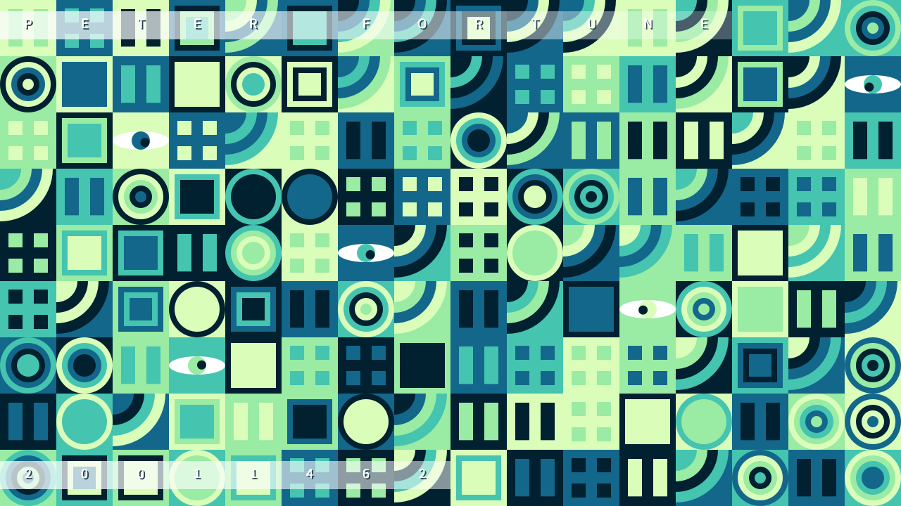

# Wondering Eyes Visual Art Piece

## Brief Description
This visual art piece is a captivating display created using Processing 4 and Java, designed to generate a random grid filled with colourful nested shapes. The assortment includes squares, arcs, pause buttons, circles, and windows, each contributing to the overall dynamism of the piece. A unique feature of this program is the addition of eyes within the grid that track the movement of the mouse cursor, adding an interactive layer to the artwork. The position of the pupils within the irises adjusts in real-time based on the mouse's location, enhancing the visual experience with interactive elements responsive to user input.

### Adobe Colour Palette
The artwork utilises a colour palette for a visually pleasing effect:
- Color 1: `#DAFDBA`
- Color 2: `#9AEBA3`
- Color 3: `#45C4B0`
- Color 4: `#13678A`
- Color 5: `#012030`
- WHITE: `#FFFFFF`

## How to Interact with the Artwork
- **Generate Art:** Press the left mouse button to create a new, unique piece of art. Each click introduces a fresh composition of shapes and colours.
- **Save Screenshot:** Use the right mouse button to save a screenshot of the current view. The screenshot is stored in the same folder as the app, with a distinct name for easy retrieval.
- **Interactive Eyes:** Move the mouse across the screen to see the eyes follow the cursor. This interactive feature adds a playful touch, engaging the viewer by reacting to their movements.

## Setup and Requirements
This project is built with Processing 4 and Java, ensuring a seamless experience across platforms where these technologies are supported. To run this art piece on your system, ensure you have Processing 4 installed along with a compatible Java Development Kit (JDK).